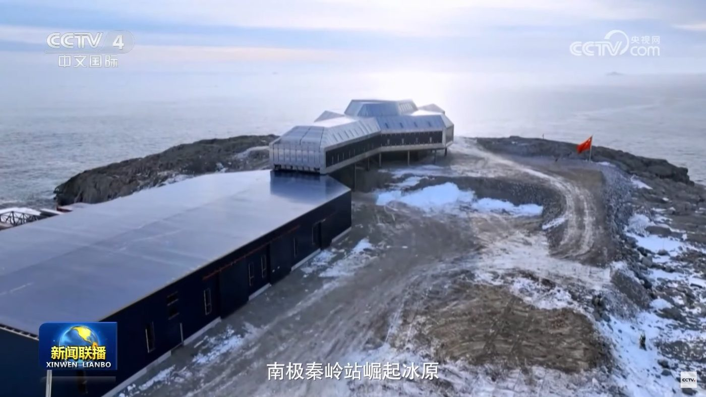

## Illustrations

*Figure 1. The Xuelong 2 polar icebreaker (雪龙2号极地考察破冰船) shown on a display screen beneath the Chinese Communist Party emblem. Photo: Erdem Lamazhapov, [CC BY-NC-ND 4.0](https://creativecommons.org/licenses/by-nc-nd/4.0/).*

*Figure 2. China's Qinling station in Antarctica (南极秦岭站崛起冰原). Screenshot from CCTV-4 news broadcast Xinwen Lianbo.*
